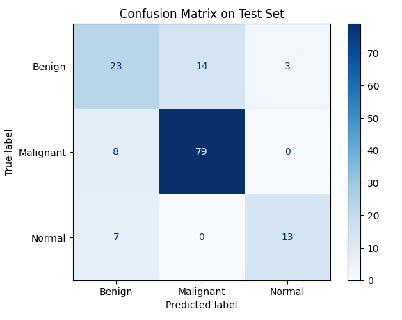

# 🧠 Liver Tumor Classification using CNN

> A deep learning project that classifies liver ultrasound images from a [Kaggle dataset](https://www.kaggle.com/datasets/orvile/annotated-ultrasound-liver-images-dataset) into **Benign**, **Malignant**, or **Normal** using a custom CNN built in PyTorch.


## 🔍 Overview

This project walks through a complete ML pipeline:
- 🧹 Data preprocessing & augmentation
- 🧠 CNN model creation and training
- 📊 Performance evaluation (accuracy, precision, recall, F1)
- 📈 Visualisation of metrics and confusion matrix


## 🧠 Tools used:

.png "PyTorch")&nbsp;&nbsp;&nbsp;&nbsp;&nbsp;&nbsp;&nbsp;


## 📂 File Structure

The notebook code

<details>
<summary>Click to expand</summary>

<pre>
liver-classification-ultrasound/                     # 🧠 Main project directory
├───data                                             # 📦 Contains all labeled dataset images and segmentations
│   ├───Benign                                       
│   │   ├───image                                    
│   │   └───segmentation                             
│   │       ├───liver                                
│   │       ├───mass                                 
│   │       └───outline                              
│   ├───Malignant                                    
│   │   ├───image                                    
│   │   └───segmentation                             
│   │       ├───liver                                
│   │       ├───mass                                 
│   │       └───outline                              
│   └───Normal                                       
│       ├───image                                    
│       └───segmentation                             
│           ├───liver                                
│           └───outline                              
├───demo_images                                      # 📷 Ultrasounds from outside the dataset
├───docs                                             # 📚 Project documentation
│   └───METHODOLOGY.md                               
├───images                                           # 🖼️ Logos and Test Set Confusion Matrix
├───models                                           
│   └───best_model.pth                               # 💾 Best-performing model checkpoint
├───src                                              
│   └───data_utils.py                                # 🧼 Script for loading/preprocessing/visualizing data
├───LICENSE.txt                                      # 📜 Licensing information (code and data)
├───README.md                                        # 📖 Project overview, usage, and setup instructions
└───tumor-classification-cnn.ipynb                   # 📓 Main notebook for model training and evaluation

</pre>

</details>

Each folder contains ultrasound images labeled accordingly.


## 🧪 Model Architecture

CNN design includes:
- 🧠 Convolutional layers with ReLU
- 🌀 MaxPooling layers
- 🔁 Dropout for regularization
- 🧮 Fully connected layers
- 🔚 Softmax for classification (3 classes)

Training:
- Loss: `CrossEntropyLoss`
- Optimizer: `Adam`


## 📊 Performance Metrics

The notebook includes:
- 📉 Training & validation loss plots
- 📈 Accuracy graphs
- 🧾 Confusion matrix
- 🏷️ Classification report (precision, recall, F1-score)


## 📈 Test Results

Achieved **78% accuracy** on test data.  
Notably high precision and recall for **Malignant** cases (F1 = 0.88).  
Benign cases showed lower recall, suggesting areas for further tuning.




**Test Accuracy:** 78.23%
**Test Loss:** 0.7269

| Class         | Precision | Recall | F1-Score | Support |
|---------------|-----------|--------|----------|---------|
| **Benign**    | 0.61      | 0.57   | 0.59     | 40      |
| **Malignant** | 0.85      | 0.91   | 0.88     | 87      |
| **Normal**    | 0.81      | 0.65   | 0.72     | 20      |
| **Accuracy**  |           |        | **0.78** | 147     |
| **Macro Avg** | 0.76      | 0.71   | 0.73     | 147     |
| **Weighted Avg** | 0.78   | 0.78   | 0.78     | 147     |

**Weighted Precision:** 0.7780  
**Weighted Recall:** 0.7823  
**Weighted F1 Score:** 0.7782


## 🚀 How to Use

```bash
# 1. Clone the repository
git clone https://github.com/JamesBuckley3/liver-tumor-classification.git

# 2. Install dependencies
pip install torch torchvision matplotlib numpy pillow
# Optional: Use a GPU-enabled environment for faster training.

# 3. Run the notebook
jupyter notebook tumor-classification-cnn.ipynb
```


## 📘 Related Files

- [`METHODOLOGY.md`](METHODOLOGY.md) — approach, iterations, and tuning insights

## 🏁 Final Thoughts and Next Steps?

This project offers a reproducible baseline for medical image classification with CNNs.  
Consider extending it with transfer learning (e.g., ResNet) or advanced augmentation strategies.

It may be worth at some point in the future using the polygon annotation data found in the respective segmentation folders to train a segmentation model (e.g. U-Net or Mask-R-CNN) that outputs pixel-wise masks of liver or tumor areas.

## 📄 License

This project is licensed under the terms described in LICENSE.txt.